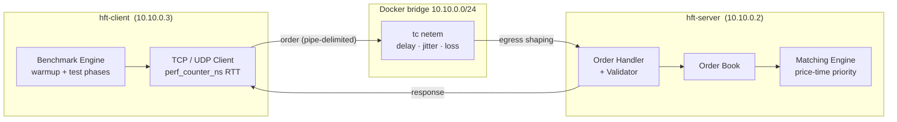
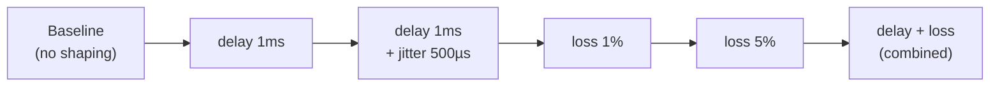
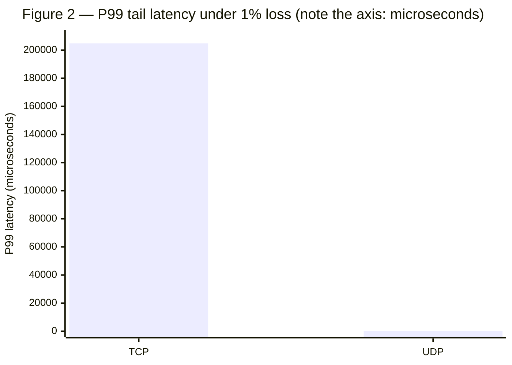

# TCP vs UDP for High-Frequency Trading: A Latency Deep-Dive

**Computer Networks — Module 5 Project | Group 07**

> 📹 **Demo Video (required): https://youtu.be/AZ7Uc7IFcnU**

---

## TL;DR

We built a miniature high-frequency trading (HFT) exchange and benchmarked the same
order flow over **TCP** and **UDP** inside an isolated Docker network, using `tc netem`
to inject controlled packet loss. The headline result: under just **1% packet loss**,
**TCP's tail latency (P99) explodes from 375 µs to 204 ms — a 545× degradation** — while
UDP's P99 stays flat at 374 µs (at the cost of permanently dropping ~1% of orders). For a
system where every microsecond is money, this is the difference between a filled order and
a missed market.

---

## 1. The Problem

In modern electronic markets, High-Frequency Trading firms compete on **latency**. They
co-locate servers next to exchanges, buy specialized NICs, and shave nanoseconds wherever
they can. At this scale, a decision usually treated as a footnote — *which transport
protocol do we use?* — becomes a first-order design choice.

The two candidates make opposite promises:

- **TCP** guarantees reliable, in-order delivery. You never lose a byte. But that guarantee
  is enforced by acknowledgements, retransmission timers, and **head-of-line blocking** —
  mechanisms that can stall delivery when the network misbehaves.
- **UDP** sends datagrams and forgets them. No handshake, no retransmission, an 8-byte
  header instead of 20+. Minimal overhead — but a lost packet is simply *gone* unless the
  application rebuilds reliability itself.

The textbook trade-off is "TCP is reliable, UDP is fast." That framing is incomplete. The
question this project actually answers is sharper:

> **When the network degrades, what does TCP's reliability guarantee cost you in latency —
> and is that cost acceptable for a latency-critical trading system?**

A protocol that is 10 µs faster on average but occasionally stalls for 200 ms is, for an
HFT system, *worse* than a protocol that is consistently predictable. **Determinism, not
just the mean, is what matters.** This is the hypothesis we set out to measure.

---

## 2. The System Under Test

To measure protocol behavior — and not the quirks of one machine — we implemented a
client-server exchange and ran it across a real (virtual) network boundary.



**Server (`hft_server`)** — accepts orders over TCP (one thread per connection,
`main_server.py:112`) and UDP (single-threaded `recvfrom` loop, `main_server.py:157`) on
the same port. `TCP_NODELAY` is set to disable Nagle's algorithm so small order packets
ship immediately. Each order flows through validation → order book → a price-time-priority
matching engine, then a response is returned.

**Client (`hft_client`)** — sends a warmup batch to stabilize caches and connections, then
fires the timed test batch. For every order it records the round-trip time with
`time.perf_counter_ns()` (`utils.py:9`), the highest-resolution monotonic clock Python
exposes, and computes the full latency distribution (mean, median, P95, P99, P99.9).

### Why Docker, and not `localhost`?

This is the most important methodological decision in the project. Benchmarking over
`127.0.0.1` is **misleading**: the OS loopback path short-circuits the NIC and most of the
network stack, so what you measure is Python socket-API overhead, not protocol behavior.

Running the client and server in **separate Docker containers** forces traffic across two
virtual Ethernet interfaces over a bridge network. Crucially, this lets us attach
**`tc netem`** to the server's egress interface to inject *quantified* delay, jitter, and
loss — turning "TCP is reliable" from a slogan into a measurable curve.



*Figure 0 — The six network scenarios, applied to the server's `eth0` egress via `tc netem`.*

---

## 3. Results

All measurements below were taken in the Docker bridge environment over 1,000 orders per
protocol. The full method is reproducible — see [§7 Running the Project](#7-running-the-project).

### 3.1 Baseline — a clean network

With no packet loss or added delay, the two protocols are nearly indistinguishable.

```mermaid
xychart-beta
    title "Figure 1 — Latency distribution, baseline (no loss). Lower is better."
    x-axis ["Min", "Mean", "Median", "P95", "P99"]
    y-axis "Latency (microseconds)" 0 --> 420
    bar [109.9, 188.6, 179.2, 263.9, 375.7]
    bar [110.3, 178.0, 169.2, 253.1, 386.1]
```



*Figure 1 — First bar (left) = **TCP**, second bar = **UDP** at each percentile. On a clean
network the curves overlap within ~10 µs; UDP is marginally faster on the body of the
distribution, TCP marginally better at P99.*

| Metric | TCP | UDP |
|--------|-----|-----|
| Min | 109.9 µs | 110.3 µs |
| Mean | 188.6 µs | 178.0 µs |
| Median | 179.2 µs | 169.2 µs |
| P95 | 263.9 µs | 253.1 µs |
| P99 | 375.7 µs | 386.1 µs |
| Max | 795.0 µs | 830.7 µs |
| Delivered | 1000 / 1000 | 1000 / 1000 |

**Deduction:** On an ideal link, TCP's reliability machinery is effectively free — there is
nothing to retransmit and nothing to reorder, so its overhead reduces to the same per-packet
cost UDP pays. The "TCP is slower" intuition simply does not show up here. *The interesting
behavior only appears when the network stops being ideal.*

### 3.2 Under 1% packet loss — the divergence

Now we apply `tc netem loss 1%` to the server egress and re-run the identical workload.



*Figure 2 — Under 1% loss, **TCP's P99 reaches 204,812 µs (≈205 ms)** while **UDP's P99 is
374.5 µs**. UDP's bar is so short it is nearly invisible against TCP's — and that invisibility
**is the result**: UDP simply does not have a tail.*

| Metric | TCP | UDP |
|--------|-----|-----|
| Min | 117.8 µs | 102.9 µs |
| Mean | **2,306 µs** | **177.9 µs** |
| Median | 194.0 µs | 172.9 µs |
| P95 | 402.4 µs | 253.4 µs |
| **P99** | **204,812 µs** | **374.5 µs** |
| Max | 212,968 µs | 559.9 µs |
| Delivered | **1000 / 1000** (retransmitted) | **992 / 1000** (8 lost) |

Two facts stand out:

1. TCP's **median barely moves** (179 → 194 µs). 99% of orders are completely unaffected.
2. TCP's **P99 jumps 545×** (375 µs → 204,812 µs), and the Max confirms a ~213 ms stall.

---

## 4. Analysis & Trade-offs

### 4.1 Why does TCP's tail explode by 545×?

The mean and median tell us this is not a uniform slowdown — it is a small number of orders
suffering an *enormous* delay. The cause is TCP's **retransmission timeout (RTO)**.

When a segment is lost, TCP cannot deliver any later data to the application until the gap
is filled — this is **head-of-line blocking** (RFC 793 §3.7). It waits for either duplicate
ACKs (fast retransmit) or, failing that, for the RTO timer to fire. The RTO is computed from
smoothed RTT estimates (RFC 6298), **but it is floored by a minimum value** — on Linux,
`TCP_RTO_MIN` is **200 ms** (`tcp(7)`, `net/tcp.h`). On a microsecond-scale LAN where the
real RTT is ~180 µs, a single tail loss that misses fast-retransmit therefore costs *at
least* 200 ms — roughly **1,000× the normal RTT**.

The logical chain:

```
1% of segments dropped
  → the dropped order can't fast-retransmit (too few dup-ACKs at our packet rate)
  → TCP falls back to the RTO timer
  → RTO is clamped to TCP_RTO_MIN = 200 ms (Linux default)
  → that order's RTT ≈ 205 ms
  → at 1,000 orders, ~1% land in the tail → P99 = 204,812 µs ✓
```

The measured ~205 ms tail is not noise — it is the **predictable fingerprint of the 200 ms
RTO floor**. This is the single most important finding of the project: TCP's reliability is
real, but on a low-latency link it is enforced at a *granularity 1,000× coarser than the
workload's own RTT*.

### 4.2 What does UDP trade away?

UDP shows no tail because it never waits — a lost datagram is never retransmitted. The cost
is visible in the delivery count: **8 of 1,000 orders (0.8%) are simply gone**, with no
notification. The surviving 992 orders are delivered with latency *identical to the
loss-free baseline*.

So the trade is explicit:

| | TCP | UDP |
|---|---|---|
| Reliability | 100% delivered (eventually) | ~99% delivered, rest lost silently |
| Tail latency under loss | **catastrophic** (200 ms+ stalls) | **flat** (unchanged from baseline) |
| Determinism | low under loss | high |
| Ordering | guaranteed | none |
| Recovery responsibility | kernel (automatic) | application (must build it) |
| Header overhead | 20+ bytes | 8 bytes |

### 4.3 The deduction for an HFT system

In high-frequency trading, a 205 ms stall is not "a slow order" — it is an *eternity*. The
market has moved; the price the order was based on no longer exists; acting on a 205 ms-old
quote can be worse than not acting at all. A **stale fill is often more damaging than a
missed one.**

This inverts the naïve reading of the data. TCP's "100% delivery" looks superior in a
spreadsheet, but for latency-critical trading, **UDP's bounded, predictable latency is the
more valuable property** — *provided* the application layer adds exactly the reliability it
needs (e.g., sequence numbers, gap detection, selective replay) rather than inheriting TCP's
one-size-fits-all recovery. This is precisely why real exchange and market-data protocols
(e.g., multicast feeds) are overwhelmingly UDP-based.

---

## 5. Conclusion

| If your priority is… | Choose | Because |
|---|---|---|
| Every message must arrive, latency is secondary | **TCP** | reliability is automatic and free on a clean link |
| Bounded, predictable latency under degradation | **UDP** | no retransmission means no tail; loss is recoverable in-app |
| Both | **UDP + app-layer reliability** | keep UDP's latency floor, add only the recovery you need |

The core lesson is that **protocol choice is a latency-determinism decision, not a
reliability decision.** On a perfect network the two are equivalent; the moment loss appears,
TCP converts lost packets into multi-hundred-millisecond stalls, while UDP converts them into
a small, measurable loss rate. For HFT, the second failure mode is the survivable one.

### Limitations & future work

- Results are from a Docker bridge on a single host; absolute numbers will differ on
  physical NICs and across real links, though the *relative* behavior (the RTO-driven tail)
  is determined by kernel defaults and should hold.
- We did not implement application-layer reliability over UDP; quantifying *how much* of
  TCP's robustness can be recovered while preserving the latency floor is the natural next
  step.
- Tuning `TCP_RTO_MIN`, enabling TCP fast-retransmit-friendly pacing, or testing QUIC would
  let us probe the middle ground between the two extremes.

---

## 6. References

1. **RFC 793** — *Transmission Control Protocol.* J. Postel, 1981. (Head-of-line blocking,
   retransmission semantics.) https://www.rfc-editor.org/rfc/rfc793
2. **RFC 768** — *User Datagram Protocol.* J. Postel, 1980. https://www.rfc-editor.org/rfc/rfc768
3. **RFC 6298** — *Computing TCP's Retransmission Timer.* Paxson et al., 2011. (RTO
   computation and the minimum-RTO requirement.) https://www.rfc-editor.org/rfc/rfc6298
4. **RFC 896** — *Congestion Control in IP/TCP Internetworks.* J. Nagle, 1984. (Nagle's
   algorithm, which `TCP_NODELAY` disables.) https://www.rfc-editor.org/rfc/rfc896
5. **Linux `tcp(7)` man page** — `TCP_RTO_MIN` / `TCP_NODELAY` socket behavior.
   https://man7.org/linux/man-pages/man7/tcp.7.html
6. **Linux `tc-netem(8)` man page** — network emulation (delay, jitter, loss) used to shape
   the test network. https://man7.org/linux/man-pages/man8/tc-netem.8.html

---

## 7. Running the Project

> Everything below reproduces the measurements in §3. The Docker path is required to
> reproduce the loss experiments; the local path is fine for a quick smoke test.

### 7.1 Quick start — Docker (recommended)

```bash
docker compose build               # build images
docker compose up server -d        # start the exchange server
docker compose run --rm client     # run the TCP + UDP benchmark
docker compose down                # tear down
```

Result JSON is written to `hft_client/results/` (volume-mounted to the host).

### 7.2 Quick start — local (two terminals)

**Terminal 1 — server:**
```bash
cd hft_server
python main_server.py
```

**Terminal 2 — client:**
```bash
cd hft_client
pip install -r requirements.txt
python main.py
```

> ⚠️ Local `127.0.0.1` runs bypass the NIC and **cannot reproduce the loss experiments** —
> use them only for a functional check (see §2, "Why Docker, and not `localhost`?").

### 7.3 Reproducing the network scenarios (`tc netem`)

With the server container running, shape its egress interface:

```bash
# Always reset before applying a new condition
docker exec hft-server tc qdisc del dev eth0 root 2>/dev/null; true

# Scenario B — fixed delay 1ms
docker exec hft-server tc qdisc add dev eth0 root netem delay 1ms

# Scenario C — delay 1ms + jitter ±500µs
docker exec hft-server tc qdisc add dev eth0 root netem delay 1ms 500us distribution normal

# Scenario D — 1% packet loss   (reproduces Figure 2)
docker exec hft-server tc qdisc add dev eth0 root netem loss 1%

# Scenario E — 5% packet loss
docker exec hft-server tc qdisc add dev eth0 root netem loss 5%

# Scenario F — combined (1ms delay + 0.5% loss)
docker exec hft-server tc qdisc add dev eth0 root netem delay 1ms loss 0.5%

docker exec hft-server tc qdisc show dev eth0   # inspect current condition
```

Then run the benchmark and compare against the reset baseline:

```bash
docker compose run --rm client python main.py --config config/settings.docker.json --orders 1000
```

Run all six scenarios in sequence:

```bash
bash scripts/run_scenarios.sh
```

### 7.4 Live web dashboard (optional)

A Flask-SocketIO dashboard streams TCP/UDP latency, throughput, and loss in real time.

```bash
docker compose up server web -d
# then open http://localhost:5000
```

| Field | Docker | Local |
|-------|--------|-------|
| Server Host | `10.10.0.2` | `127.0.0.1` |
| Port | `8888` | `8888` |
| Protocol | TCP or UDP | TCP or UDP |
| Orders / sec | e.g. `50` | e.g. `50` |

Local dashboard only:

```bash
cd hft_client && pip install -r requirements.txt && python web_server.py
# http://127.0.0.1:5000  →  Server Host 127.0.0.1, Port 8888  →  ▶ Start
```

### 7.5 Command-line options

**Server:**
```bash
python main_server.py                       # sync mode, TCP + UDP on 8888
python main_server.py --mode async          # asyncio backend
python main_server.py --dummy               # inject artificial 100–500µs latency
python main_server.py --port 9999 --udp-port 9998
```

**Client:**
```bash
python main.py                              # TCP + UDP (default)
python main.py --protocol tcp               # single protocol
python main.py --orders 5000 --interval 50 --warmup 50
```

---

## 8. Configuration

<details>
<summary>Server — <code>hft_server/config/server_settings.json</code></summary>

```json
{
    "server":      { "host": "0.0.0.0", "port": 8888, "backlog": 100, "max_connections": 1000 },
    "performance": { "tcp_nodelay": true, "so_reuseaddr": true, "buffer_size": 65536 },
    "order_book":  { "symbols": ["BTC-USD", "ETH-USD", "AAPL"], "max_order_size": 10000, "min_order_size": 1 },
    "simulation":  { "enabled": false, "min_latency_us": 100, "max_latency_us": 500 }
}
```
</details>

<details>
<summary>Client (Docker) — <code>hft_client/config/settings.docker.json</code></summary>

```json
{
    "server":    { "host": "10.10.0.2", "port": 8888, "protocol": "tcp" },
    "client":    { "tcp_nodelay": true, "socket_timeout_ms": 5000 },
    "benchmark": { "warmup_orders": 100, "test_orders": 10000, "interval_us": 100, "save_results": true, "results_dir": "results" },
    "symbols":   ["BTC-USD", "ETH-USD", "AAPL"]
}
```
</details>

The local client config (`hft_client/config/settings.json`) is identical except `host` is
`127.0.0.1` and there is no `client` block.

---

## 9. Project Structure

```
.
├── hft_server/
│   ├── main_server.py              # entry point — sync & async servers
│   ├── config/server_settings.json
│   └── src/
│       ├── order_book.py           # exchange state, order book
│       ├── matcher.py              # price-time priority matching
│       └── handler.py              # request handling & validation
│
├── hft_client/
│   ├── main.py                     # benchmark CLI entry point
│   ├── web_server.py               # Flask-SocketIO dashboard
│   ├── config/{settings,settings.docker}.json
│   ├── src/
│   │   ├── protocol.py             # order message protocol
│   │   ├── client.py               # TCP / UDP clients
│   │   ├── benchmark.py            # latency benchmark engine
│   │   └── utils.py                # stats & RTT clock (perf_counter_ns)
│   ├── static/  templates/         # dashboard front-end
│   └── results/                    # benchmark output (JSON)
│
├── scripts/run_scenarios.sh        # runs all six netem scenarios
│
├── presentation/                   # report & presentation assets
│   ├── CN_Module5_MidpointReport_Group07.md / .pdf
│   ├── PLAN.md   presentation.html
│   └── scripts/01_boseok.md … 04_junseo.md
│
├── bugreport.md   team_summary.html
└── docker-compose.yml
```

---

## Course Information

**Course:** Computer Networks · **Module:** Module 5 — Transport Layer Protocols ·
**Group:** Group 07 · **Year:** 2026

Educational project. Built with Python 3 (server uses the standard library only),
Flask-SocketIO (dashboard), and Docker + `tc netem` (network emulation).
